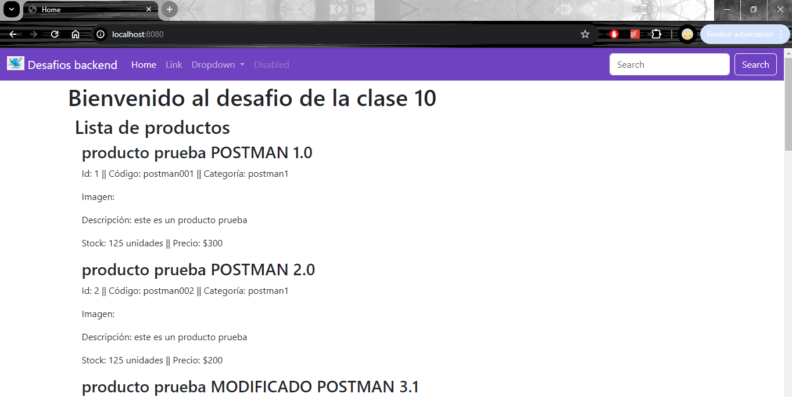
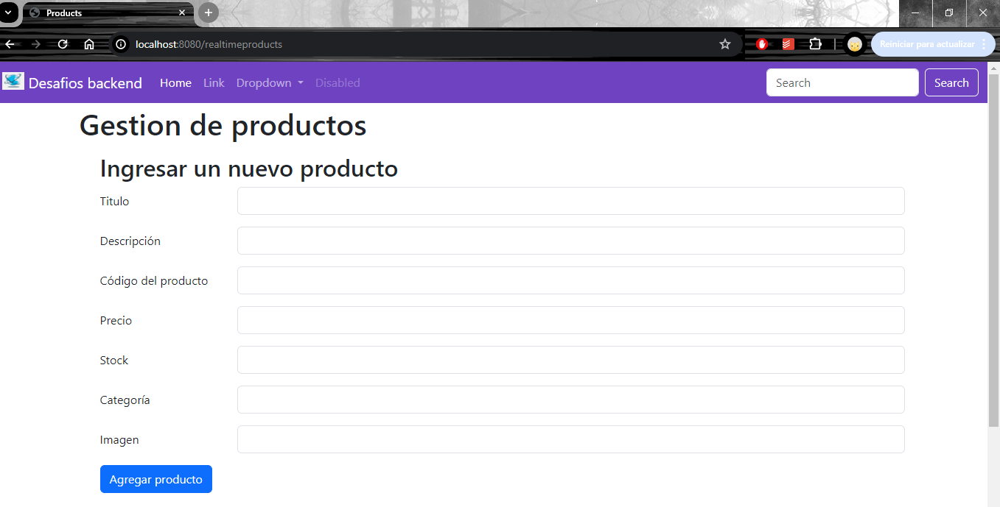
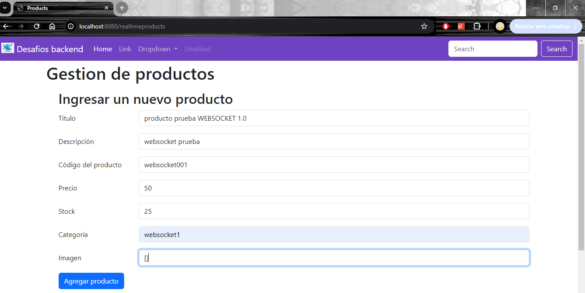

# desafiosBackendAguirreFunesSabrina

### Cuarto desafío (carpeta _"desafioClase10"_)

A partir del proyecto entregado en la primer pre-entrega, se configuro el servidor para integrar el motor de planitllas "Handlebars" instalando un servidor de socket.io.

Se adjunta capturas del funcionamiento en el navegador.

#### Nuevas rutas

- ruta _/static_ -> utilizando únicamente handlebars, muestra una vista con el listado de todos los productos



- ruta _/realtimeproducts_ -> utilizando en conjunto handlebars y websocket, muestra una vista con:
  - un formulario para agregar productos
  - un formulario para eliminar un producto a partir de un id
  - un listado de todos los productos (el cual se actualiza automáticamente cada vez que se agrega o elimina un producto)

Prueba de agregar productos:



#### Pasos para ejecutar el servidor

- Primero se deberá entrar en la carpeta del desafío con el comando:

```
cd desafioClase10
```

- Una vez dentro de la carpeta se instalarán las dependencias con el comando:

```
npm install
```

- Finalmente se podrá poner en marcha el servidor con el comando:

```
npm run dev
```
