# desafiosBackendAguirreFunesSabrina

### Primer pre-entrega (carpeta _"primerPreEntrega"_)

Se utilizó las clases "ProductManager" y "Product", con sus métodos, creados en desafíos anteriores.

Se crearon las clases "CartManager" y "Cart", con sus respectivos métodos para el manejo de los mismos.

Se realizó el desarrollo de un servidor basado en Node.JS y express, que escuchen el puerto 8080 y con dos grupos de rutas con sus respectivos endpoints implementados con el router de express.

Se utilizaron las rutas para crear y modificar los productos y carritos mediante POSTMAN (se adjuntaron capturas de pantalla de pruebas realizadas en cada ruta).

#### Rutas de productos

- ruta GET _/api/products_ -> al no recibir un query, leerá el archivo de productos y devolverá la totalidad del mismo como un array en formato string.

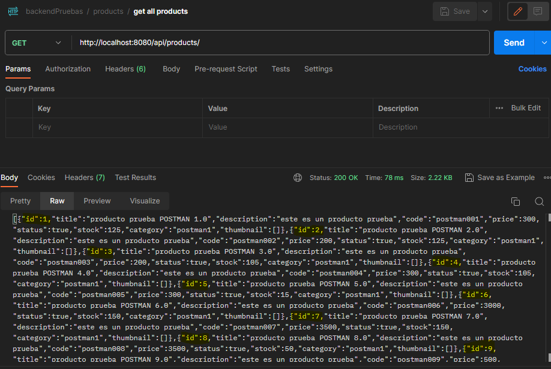

- ruta GET _/api/products?limit=x_ -> recibirá por query un límite _x_ que definirá el límite de resultados a mostrar. Leerá el archivo de productos y devolverá la cantidad de productos solicitados en el query como un array en formato string.

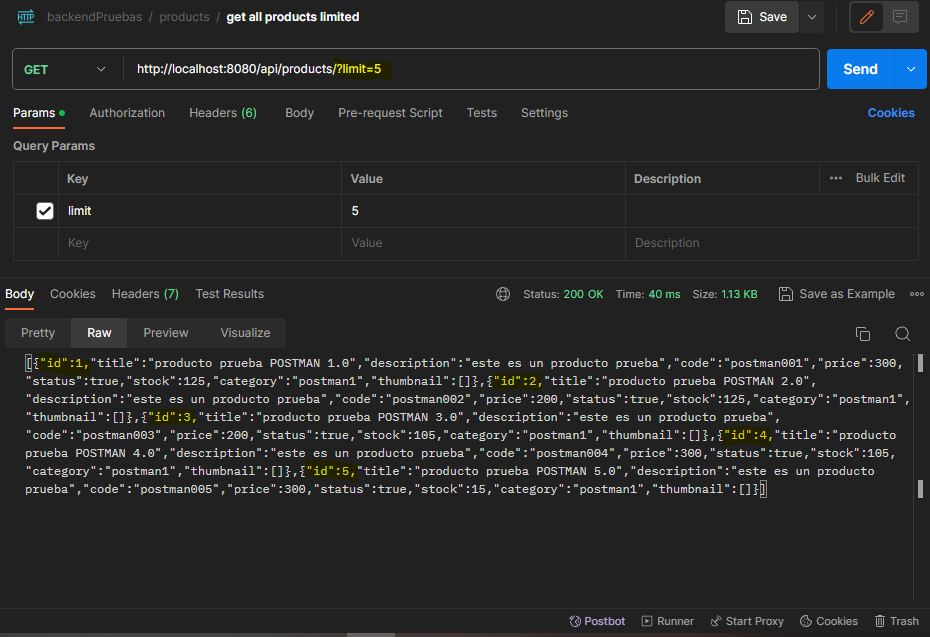

- ruta GET _/api/products/:pid_ -> recibirá por params el pid (id de producto) y devolverá sólo el producto solicitado como un array con un único objeto en formato string.

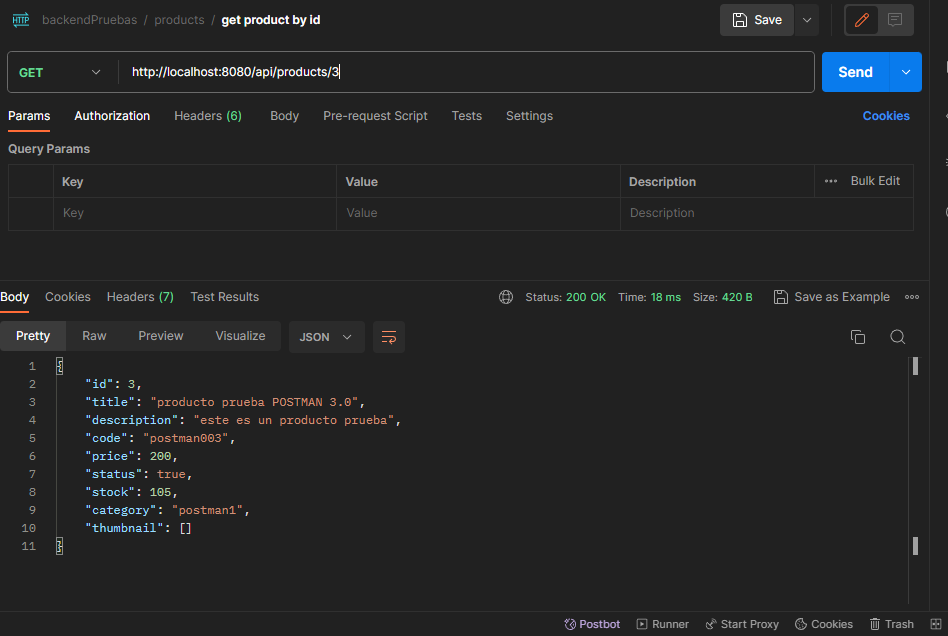

- ruta POST _/api/products_ -> agregara un nuevo producto con los parametros recibidos del body (se recibira en formato json los datos del producto).

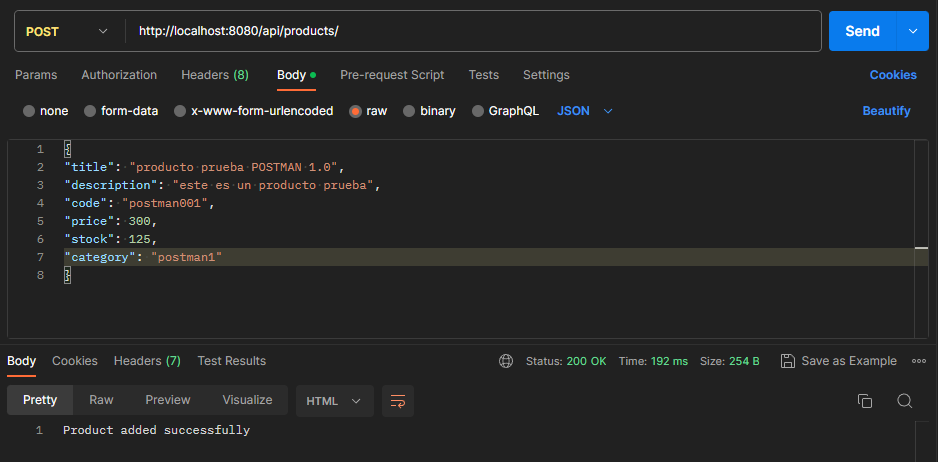

- ruta PUT _/api/products/:pid_ -> actualizara los campos del producto del id indicado con los datos recibidos del body (los mismos se recibiran en formato json desde el body)

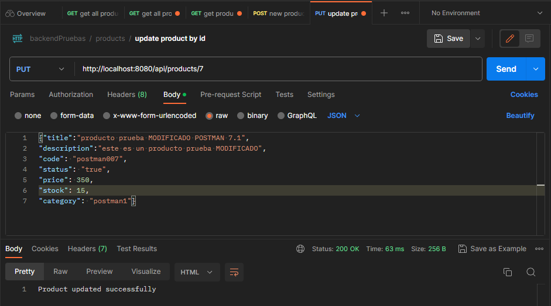
se probo que se haya modificado el producto:
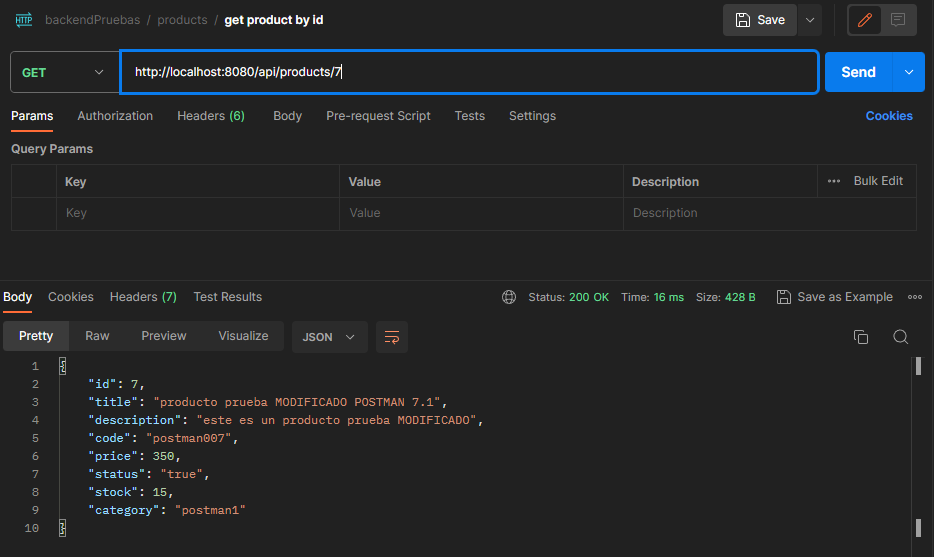

- ruta DELETE _/api/products/:pid_ -> eliminara el producto del id indicado.

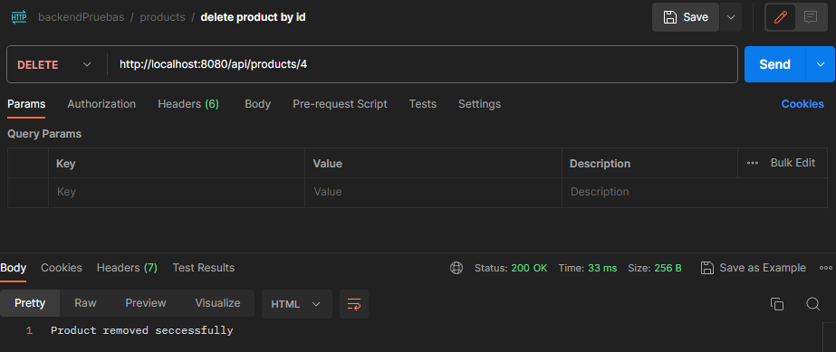
se probo que se haya eliminado el producto:
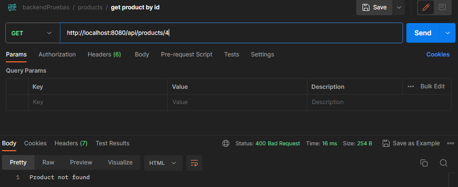

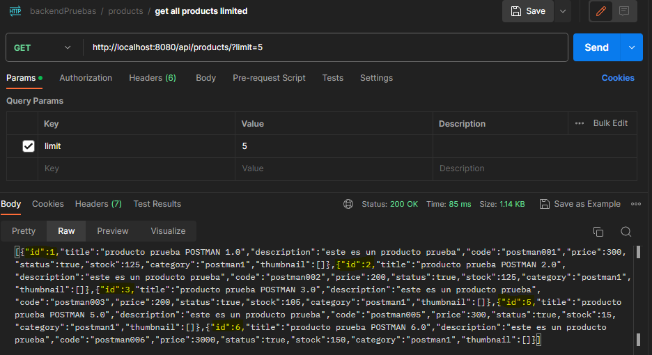

#### Rutas de carrito

- ruta POST _/api/carts/_ -> creara un nuevo carrito con un id y un array vacio para los productos

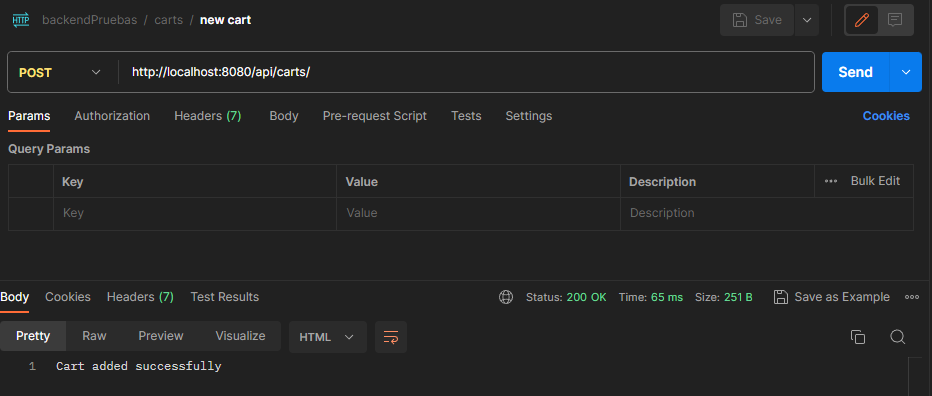

- ruta GET _/api/carts/:cid_ -> devolvera los datos del carrito del id indicado por params.

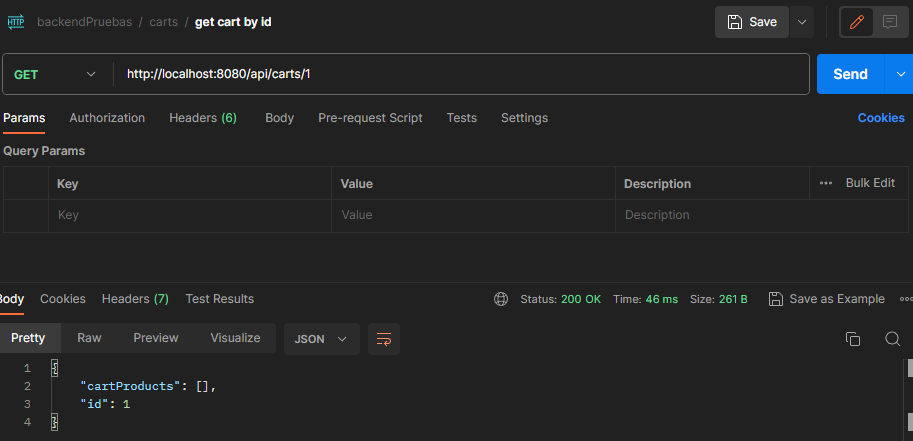

- ruta POST _/api/carts/:cid/product/:pid_ -> agregara al carrito del id indicado en params, el producto del id indicado en params. Se guardara en el carrito solo el id del producto y una variable de cantidad. Si el producto ya existiera en ese carrito, se sumara 1 en la variable cantidad.

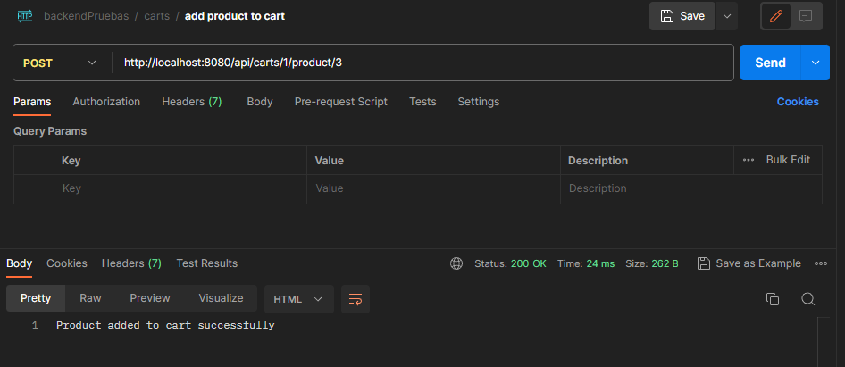

al agregarse varios productos, repitiendo varios de ellos, el carrito quedo de la siguiente forma:

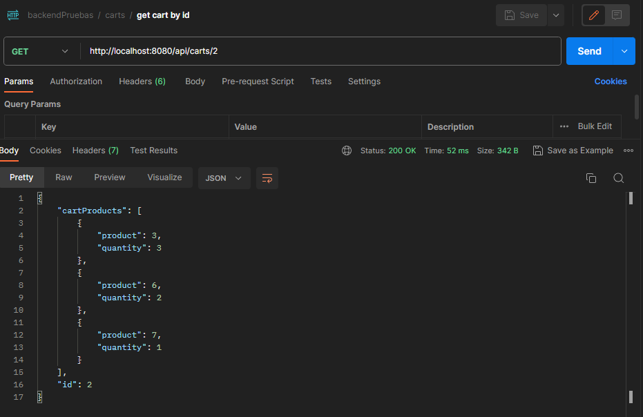

##### Pasos para ejecutar el servidor

- Primero se deberá entrar en la carpeta del desafío con el comando:

```
cd primerPreEntrega
```

- Una vez dentro de la carpeta se instalarán las dependencias con el comando:

```
npm install
```

- Finalmente se podrá poner en marcha el servidor con el comando:

```
npm run dev
```
